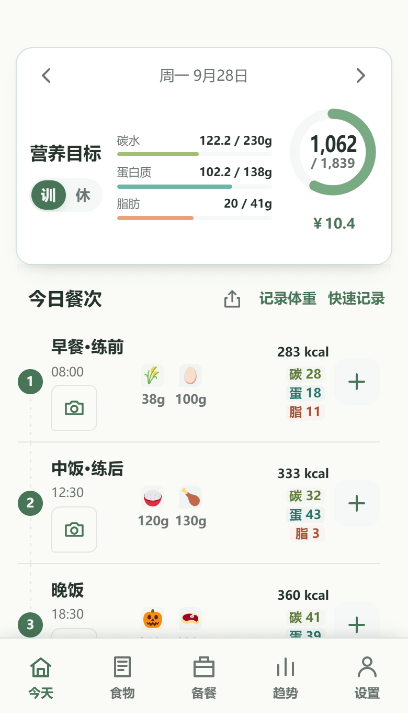
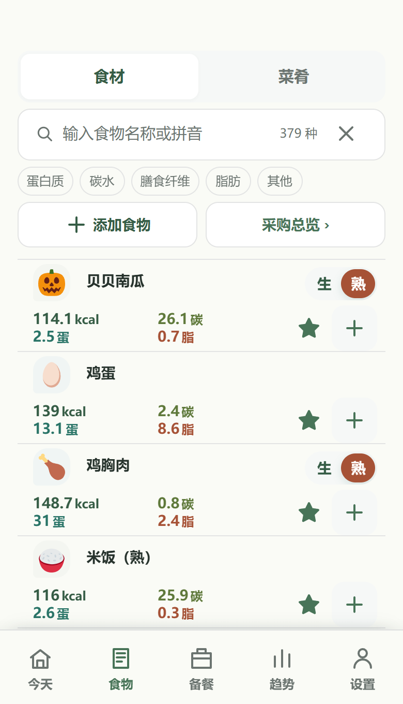
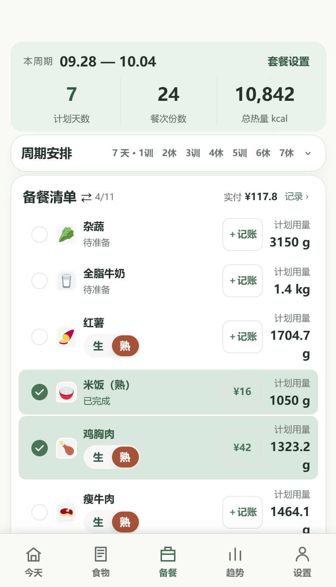
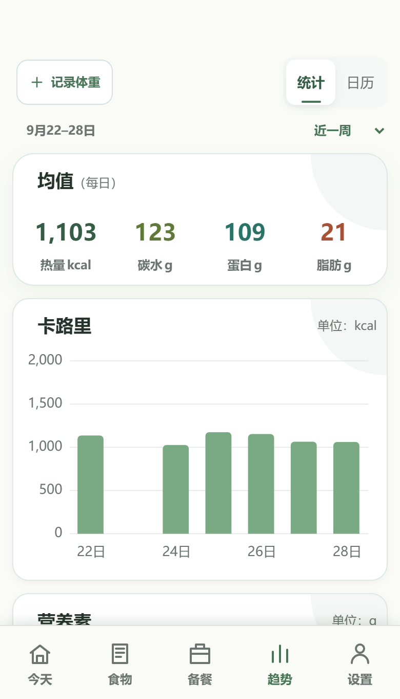
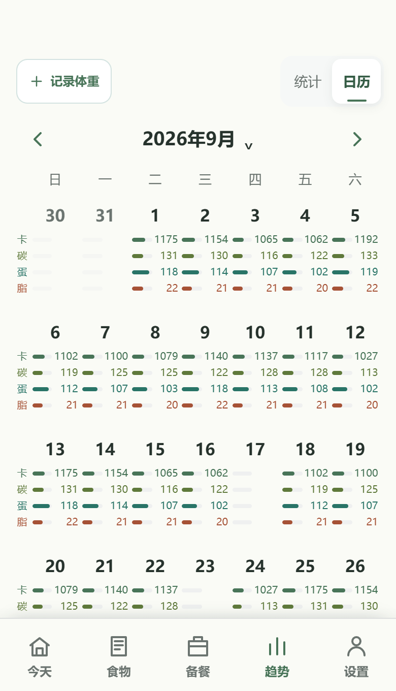
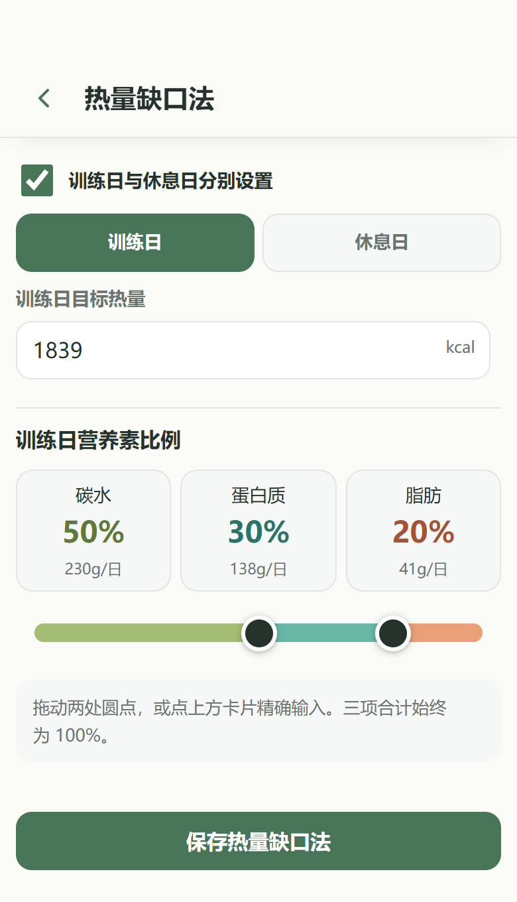
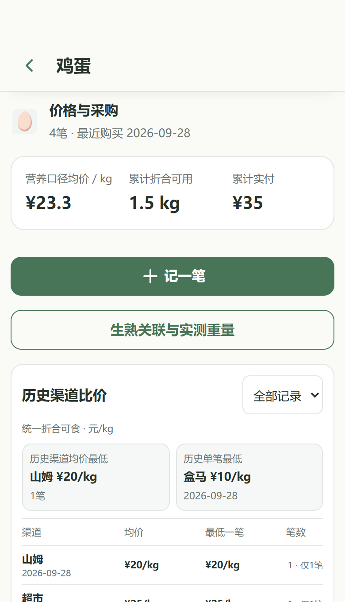

<div align="center">

# 食由己 · Diet Helper

**从记录一餐，到安排下一餐。**

面向 HarmonyOS 的本地优先饮食管理应用，将营养记录、食物管理、周期备餐、采购成本和体重趋势放在一起。

**无需账号 · 本地存储 · Web 可运行 · MIT License**

[功能介绍](#功能介绍) · [界面展示](#界面展示) · [快速开始](#快速开始) · [参与贡献](#参与贡献)

</div>

## 为什么做食由己

饮食管理既有「今天吃了多少」，也有「明天怎么备餐、食材买多少、这一餐花了多少」。食由己把这些日常问题连接起来：设置目标、按餐记录、复用菜肴和套餐、汇总备餐原料，再通过趋势调整自己的节奏。

- **记录贴近真实吃法**：食材与菜肴都能记入餐食，支持生熟重量和可食重量换算。
- **计划落实到采购**：周期套餐生成备餐清单，采购记录为食材成本和渠道比价提供依据。
- **数据由自己管理**：核心记录无需账号或云端服务，支持本地备份与恢复。

## 功能介绍

| 功能 | 可以做什么 |
| --- | --- |
| 今日饮食 | 切换训练日／休息日目标，按餐记录和打卡，快加食物，附餐食照片，生成每日分享 |
| 食物与菜肴 | 按名称或拼音查找食材，管理收藏、菜肴配方与辅料，换算生熟及可食重量 |
| 周期备餐 | 复用套餐、汇总原材料用量、估算费用，逐项勾选备餐清单 |
| 趋势与月历 | 查看热量、碳水、蛋白质、脂肪和饮食花费趋势，按月回看每日记录 |
| 目标与体重 | 使用热量缺口法或自定义目标，分别设置训练／休息日营养比例，记录体重并复盘 |
| 采购与比价 | 记录采购渠道、重量和实付，对比历史均价、渠道均价与单次采购价格 |
| 个性化与备份 | 选择四套主题、可选功能和体重单位，通过数据管理备份、恢复本地记录 |

## 界面展示

### 记录、选食物、做备餐

<table>
  <tr>
    <th width="33%">今日饮食</th>
    <th width="33%">食物与菜肴</th>
    <th width="33%">周期备餐</th>
  </tr>
  <tr>
    <td></td>
    <td></td>
    <td></td>
  </tr>
</table>

### 从一天的记录，看一段时间的变化

<table>
  <tr>
    <th width="50%">营养与花费趋势</th>
    <th width="50%">饮食月历</th>
  </tr>
  <tr>
    <td align="center"></td>
    <td align="center"></td>
  </tr>
</table>

### 让目标和花费都有依据

<table>
  <tr>
    <th width="50%">热量缺口与分日目标</th>
    <th width="50%">采购记录与比价</th>
  </tr>
  <tr>
    <td align="center"></td>
    <td align="center"></td>
  </tr>
</table>

## 快速开始

### 在浏览器中运行

准备 Git 和 Python 3，然后执行：

```bash
git clone https://github.com/sunyia123/Diet-Helper.git
cd Diet-Helper
python -m http.server 5178 --bind 127.0.0.1
```

- 产品介绍：<http://127.0.0.1:5178/>
- 交互工作台：<http://127.0.0.1:5178/design-demo/calm-path-v1/>

Web 部分使用原生 HTML、CSS 和 JavaScript，无需安装 npm 依赖或启动后端。日常记录主要保存在当前浏览器的 `localStorage`，餐食照片保存在 `IndexedDB`；数据管理入口位于「设置 → 数据与备份」。

### 在 HarmonyOS 中运行

使用 DevEco Studio 打开仓库根目录，安装工程所需 SDK，配置自己的应用签名后构建 `entry` 模块。

应用通过 ArkTS WebView 加载包内页面，桥接系统避让区、数据传输、体重接口和桌面营养卡片。浏览器工作台与设备端各自保存数据，不会自动同步；系统桥接能力需在 HarmonyOS 环境使用。分发自己的构建时，请配置自己的包名、App ID 和签名材料。

## 项目结构

```text
AppScope/                          HarmonyOS 应用配置与资源
design-demo/calm-path-v1/          Web 开发主源
entry/src/main/ets/pages/Index.ets WebView 入口
entry/src/main/ets/services/       Web 与 HarmonyOS 的桥接服务
entry/src/main/resources/rawfile/  应用包内的 Web 资源
showcase/screenshots/              七张产品界面截图
index.html                        产品介绍页
showcase.css                      产品介绍页样式
tokens.css                        产品介绍页设计变量
```

开发 Web 交互时，从 `design-demo/calm-path-v1/` 开始；打包 HarmonyOS 应用时，需将对应 Web 资源同步到 `entry/src/main/resources/rawfile/calm-path-v1/`。营养记录使用独立快照，避免编辑食物资料时改写过去的餐食记录。

## 参与贡献

欢迎通过 [Issues](https://github.com/sunyia123/Diet-Helper/issues) 反馈问题或提出建议，也欢迎提交 Pull Request。

反馈时请附上运行环境、复现步骤、预期行为和实际结果。界面调整请兼顾窄屏体验；涉及食物、菜肴或套餐的数据修改，请保留既有记录和历史营养快照。分享截图或数据样例前，请移除个人信息。

## 许可证

自有代码采用 [MIT License](./LICENSE)。第三方图标与素材遵循各自的许可，来源及署名见 [素材说明](./design-demo/calm-path-v1/assets/food-icons/ATTRIBUTION.md) 和对应目录中的许可证。
